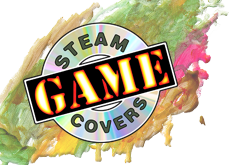
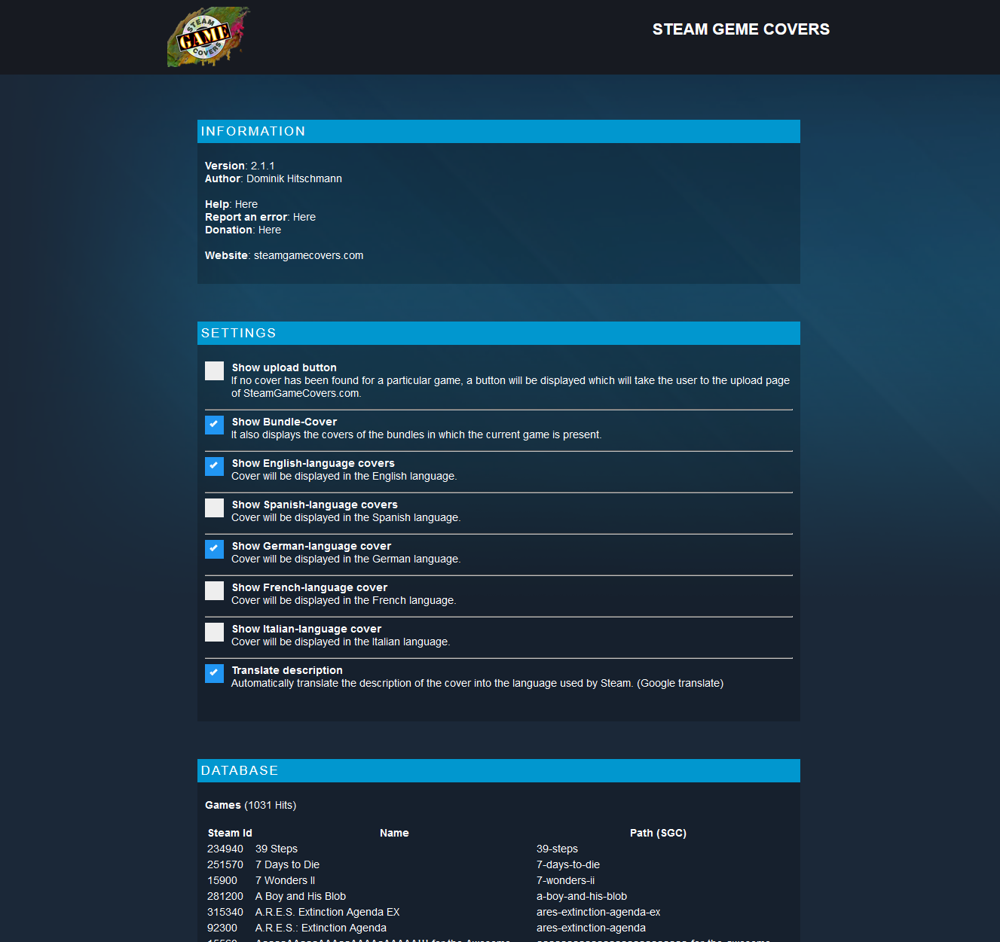
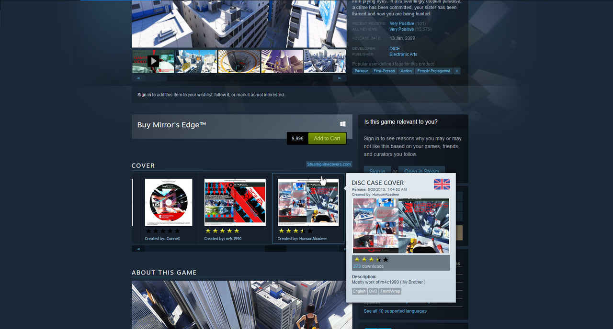
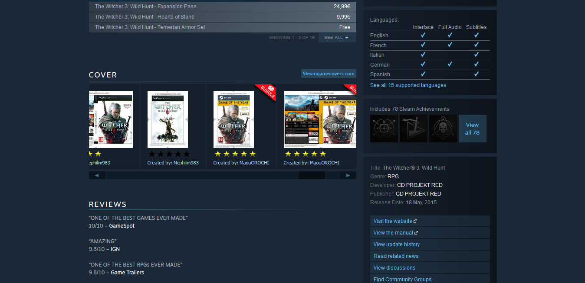

  
  
  
  
  
  
  <!-- PROJECT LOGO -->
   
   
  

  <h3 align="center">Steam Game Covers (Add-on)</h3>

  

    An Browser-AddOn for Google Crome and Firefox, to integrate the Steam-Covers on the Steam-Page. 
     
    <a href="https://www.steamgamecovers.com/"><strong>Go to steamgamecovers.com »</strong></a>
     
     
    <a href="https://github.com/domidodo/steam-game-covers-add-on/issues">Report Bug</a>
    ·
    <a href="https://github.com/domidodo/steam-game-covers-add-on/issues">Request Feature</a>
  

## Table of Contents
<!-- TABLE OF CONTENTS -->
<ol>
  <li><a href="#table-of-contents">Table of Contents</a></li>
  <li>
    <a href="#about-the-project">About The Project</a>
    <ul>
      <li><a href="#built-with">Built With</a></li>
    </ul>
  </li>
  <li><a href="#screenshots">Screenshots</a></li>
  <li><a href="#installation">Installation</a></li>
  <li><a href="#contributing">Contributing</a></li>
  <li><a href="#license">License</a></li>
</ol>

<!-- ABOUT THE PROJECT -->
## About The Project

Burn your Steam game backups to a CD that&#39;s as great as the game itself. For that you need really good covers. This add-on adds a &#34;Cover&#34;-tab to the Steam games page. 
It include: 
- Disc faces 
- Jewel cases 
- Amary cases 
- BlueRay cases

(<a href="#readme-top">back to top</a>)

### Built With

* [![PHP][Js]][Js-url]

(<a href="#readme-top">back to top</a>)

### Screenshots

</img>
 </img>
 </img>
 </img>

<!-- GETTING STARTED -->

### Installation

FireFox:
https://addons.mozilla.org/en-US/firefox/addon/steam-game-covers/

Google Chrome:
https://chrome.google.com/webstore/detail/steam-game-covers/llebobhdlimlfpiebmdjmjbkipmcfmap

(<a href="#readme-top">back to top</a>)

<!-- CONTRIBUTING -->
## Contributing

If you have a suggestion that would make this better, please fork the repo and create a pull request. You can also simply open an issue with the tag "enhancement".
Don't forget to give the project a star! Thanks again!

1. Fork the Project
2. Create your Feature Branch (`git checkout -b feature/AmazingFeature`)
3. Commit your Changes (`git commit -m 'Add some AmazingFeature'`)
4. Push to the Branch (`git push origin feature/AmazingFeature`)
5. Open a Pull Request

(<a href="#readme-top">back to top</a>)

<!-- LICENSE -->
## License

Distributed under the MIT License. See `LICENSE` for more information.

(<a href="#readme-top">back to top</a>)

<!-- MARKDOWN LINKS & IMAGES -->
<!-- https://www.markdownguide.org/basic-syntax/#reference-style-links -->
[Js]: https://shields.io/badge/JavaScript-F7DF1E?logo=JavaScript&logoColor=000&style=flat-square
[Js-url]: https://wiki.selfhtml.org/wiki/JavaScript
